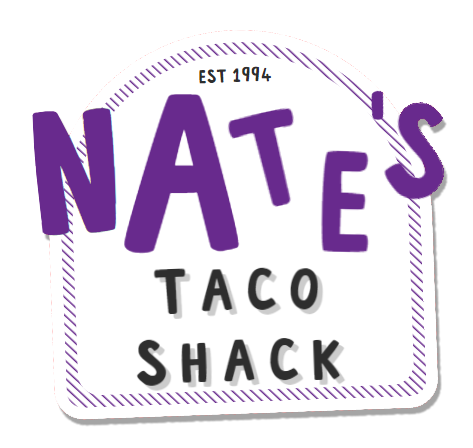
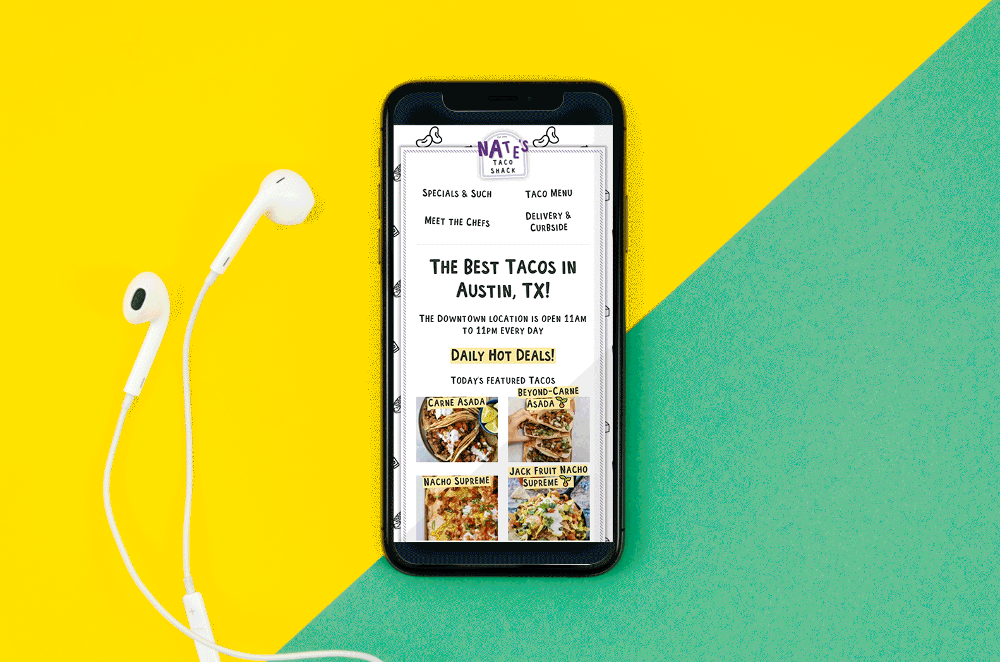

    

    
    
    
    
    

 
 

    

---

---

    
    <a href="#top">top ⤴</a>

In an effort to understand what Serverless Applications are I completed a course on what it is, how it works, and where its going in the future. Here is the product after completing about 120hrs+ of study.

Here we have "Nate's Taco Shack", a fictional restaurant based out of Austin, TX. We give users the ability to view the current menu, chefs employed at our location, order for curbside or delivery, recieve emailed order details, and a hidden feature for a beer menu!

This application goes over a **ton** of modern web development practices and features. Such as, ES6 JavaScript, Gatsby, React.js, GraphQL, Headless CMS, Progressive Images, Scoped CSS, Serverless Functions.

There is some really good stuff here, check it out, read the README, click the links, whatever makes your heart content. 😊

---

---

## 
 Check out some of the breakdowns of what we have for you! 

| <a href="#graphiql">Client GraphiQL</a> || <a href="#customhooks">Order with Custom Hooks</a> || <a href="#pagination">Pagination</a> || <a href="#api">Api Call</a> || <a href="#mobile">Mobile Responsiveness</a> || <a href="#custom">Custom Loading States</a> |

---

    

## 
Client GraphiQL

Gatsby will cache the data from our Sanity Headless CMS. Here we are Querying Tacos according to their ingredients using a REGEX statement.

---

    

## 
Order with Custom Hooks

There is quite a lot going in in this page. Custom hooks is the name of the game. We are injecting a custom Context that will set state for a custom provider. When the user actually "submits" their order, we also have a serverless function that will then use NodeMailer to send the order details. P.S we have a Honey Pot! 🍯 to defend against bots 🤖

---

    

## 
Pagination

What do we do to prevent from too much data from spilling on our pages? Dynamic pages that will look at our data and create 1 page per 3 chefs. If we manipulate our amount of employees, Gatsby will adjust the amount of pages we output.

---

    

## 
API Call

Gatsby dynamic components come back again for this one! We are calling for some dummy data from <a href="https://api.sampleapis.com">SampleAPIs.com</a> then use the _createContentDigest_ api provided via Gatsby to create all of our nodes!

---

    

## 
Mobile Responsiveness

CSS Grid, Flexbox, and Media Queries all working in unison to build a beautiful desktop _and_ mobile app!

---

    

## 
Custom Loading States

It **is** possible to directly make a GraphQL Query from out Serverless Gatsby app to the Sanity Headless CMS. But it takes longer than it would to just query our cached client data. Our Grids ridged frame makes it possible to chack for a loading state and use place holder items complete with dynamic item rendering according depending on the number queried, and some clever CSS animations.
